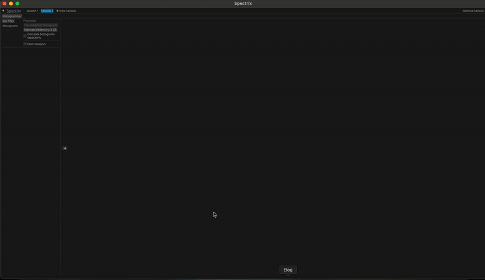
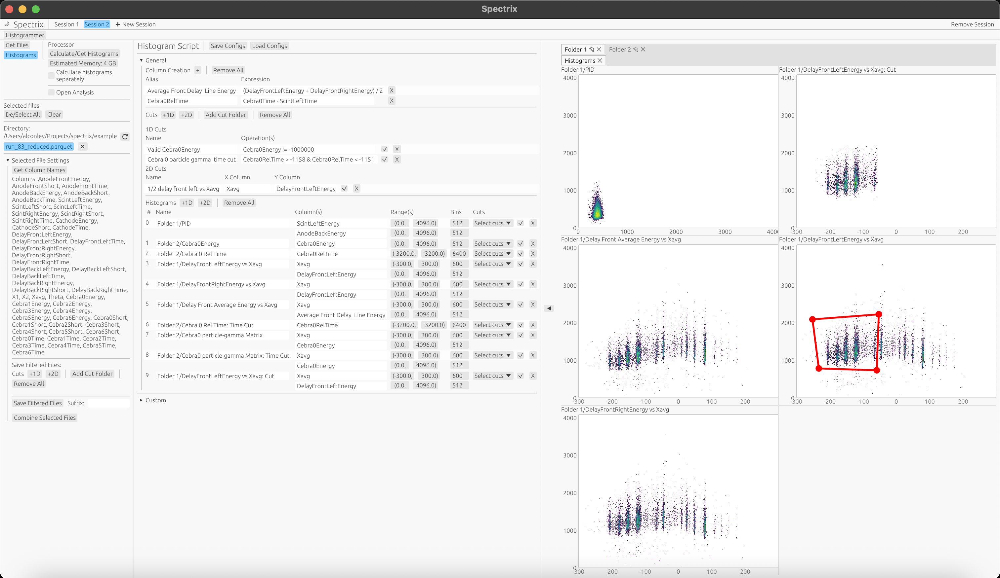
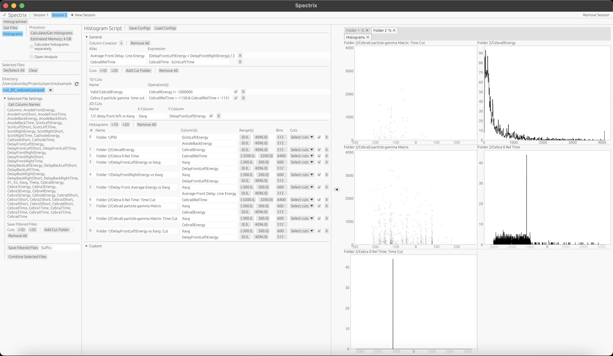
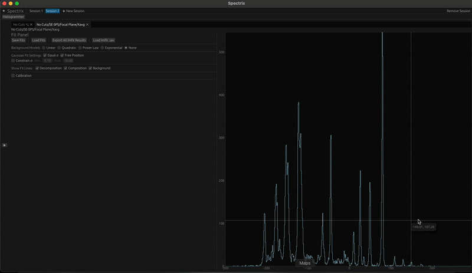

# Spectrix

**Spectrix** is a comprehensive software package for **nuclear spectrum analysis**. It provides tools for histogramming, Gaussian fitting, and interactive visualization of 1D and 2D histograms using the crates:  
`egui`, `egui-tiles`, `egui_plot`, and `polars`.

Additionally, using **uproot**, you can view 1D and 2D ROOT histograms. Fitting is performed using Python’s **lmfit** library.



---

## 🧩 Features

- Read and analyze `.parquet` and `.root` files  
- Interactive histogramming (1D & 2D)  
- Gaussian fitting with Python’s lmfit  
- UI-based histogram and cut definition  
- Custom histogram scripting  
- Integration with Polars for high-performance data processing  

---

## 🚀 Running Spectrix

### Tested Platforms

- **macOS Sonoma 14.6.1** on Apple M3 MacBook Pro (18 GB RAM)  
- **Ubuntu 22.04.5 LTS**  
- **Windows 10**

> ⚠️ Both use Python 3.13.  
> On Windows, ensure that Python is downloaded from [python.org](https://www.python.org/downloads/).

---

### Install Rust

Ensure you’re using the latest stable version of Rust:

```bash
rustup update
```

If you don’t have Rust installed, visit the [Rust website](https://www.rust-lang.org/tools/install) and follow the instructions.

---

### System Dependencies

**For Linux/macOS:**

```bash
sudo apt-get install libxcb-render0-dev libxcb-shape0-dev libxcb-xfixes0-dev libxkbcommon-dev libssl-dev libgtk-3-dev
```

---

### Installation Steps

**Clone the repository**

```bash
git clone https://github.com/alconley/spectrix.git
cd spectrix
```

**Create a Python virtual environment and activate it**
```bash
python3 -m venv .venv
source .venv/bin/activate
```

**Install the required python packages**
```bash
pip install -r requirements.txt
```

**(Optional, but often required on macOS (see ./spectrix.sh script))
Set the Python environment for Rust (PyO3)**
```bash
export PYO3_PYTHON=$(pwd)/.venv/bin/python
export PYTHONPATH=$(pwd)/.venv/lib/python3.*/site-packages
```

Run the Rust project in release mode**
```bash
cargo run --elease
```

**Tips if the program doesn't run**
```bash
rustup update
cargo clean
cargo update
```

## Overview

The **Spectrix** program reads `.parquet` files using the [Polars](https://docs.rs/polars/latest/polars/) crate.  
Typically, `.parquet` files are generated by [Eventbuilder](https://github.com/alconley/Eventbuilder). These files store raw data as `f64` in a dataframe format (similar to a ROOT tree).  

Histograms can be configured in the left panel of the UI. New column creation and cuts can also be performed directly in the UI.

Additionally, users can read 1D and 2D histograms from ROOT files using the Python package **uproot**.  

If there are issues reading ROOT files or you have additional requests, please open an issue or contact me — I can add support for more ROOT structures.  
In the future, I plan to add the ability to read ROOT trees directly and perform histogramming within Spectrix.  
For now, ROOT trees can easily be converted to `.parquet` format using [HEP-Convert](https://hepconvert.readthedocs.io/en/latest/root_to_parquet.html).

---

## Getting Files

Use the **`Get Files`** button and select either a folder or a file.  
If a folder is selected, Spectrix will automatically load any `.parquet` or `.root` files it finds.

### Root Files

If a `.root` file is selected, Spectrix will attempt to load all 1D and 2D histograms from the file.  
ROOT histogram paths such as `/name1/name2/histogram_name` will be used to organize histograms into container hierarchies.

### Parquet Files

This is the **preferred format**, as Spectrix can calculate histograms directly from the raw data using its internal histogram script system.

If you’re unsure of all available column names, open the collapsible **“Selected File Settings”** section and click **“Get Column Names.”**  
Spectrix will display all columns from the selected `.parquet` files.

In this same section, you can:
- Save filtered versions of your `.parquet` files.
- Combine multiple files into one.

When saving filtered files, Spectrix will apply any **active 1D or 2D cuts** and save the output as `filename_{prefix}.parquet`.

> ⚠️ **Warning:**  
> Combining files loads all data into memory. If the datasets are large, this may crash your system.  
> It’s best to apply a filtering cut first (reducing the data size) before combining.

---

## Histogram Script

The **Histogram Script** panel can be opened or closed using the **“Histograms”** button under the **“Get Files”** button.

This tool allows you to:
- Define new columns within `.parquet` data.
- Define relevant **1D and 2D cuts**.
- Define **1D and 2D histograms** (name, data columns, binning, range, and applied cuts).

If you create histogram scripts in the UI, they can be **saved or loaded** as `.json` configuration files.

---

### Example

Below are example images of Spectrix using the sample file located at  
`./examples/run_83_reduced.parquet`.

This dataset comes from a one-hour measurement of the **52Cr(d,pγ)53Cr** reaction.  
The file is pre-filtered to include only proton data (the full dataset was too large for GitHub).  

Invalid detector values are stored as `-1e6`, which marks cases where a detector did not register a hit within an event window.  
This ensures that all columns have the same length.  
The file was generated using [Eventbuilder](https://github.com/alconley/Eventbuilder).

  


---

The following subsections assume you are in the **“General”** section of the **Histogram Script** panel.

### Column Creation

You can create new columns, such as time differences or averages of existing columns.  
Examples of both are shown in the images above.

> ⚠️ **Tip:**  
> Define column aliases (names) without spaces.  
> This is required for correct parsing in string-based 1D cut expressions.

### Cuts

Users can define 1D cuts by specifying a name and an expression.  
Use column names and logical operators such as `&` to combine conditions.  

Cuts must be selected in the corresponding UI checkboxes for both 1D and 2D histograms in order to be applied.

### Histogram Definitions

Type in the desired histogram name.  
Using slashes (`/`) will automatically group histograms into nested containers.

The **“Column(s)”** field must exactly match a column name from the `.parquet` file or a previously created alias.  
Then, specify the range, number of bins, and any active cuts to apply.

Make sure that all cuts you wish to apply are active in the UI.

---

## Custom Scripts

The **Custom Scripts** section provides a UI-based way to define and load pre-configured histogram setups.  
These scripts act as a front-end to the **Histogram Script**, allowing users to quickly initialize commonly used columns, cuts, and histograms without manually creating them each time.

In other words, the Custom Scripts system automatically generates a full histogram configuration through the interface — simplifying setup for frequent or experiment-specific analyses.

Currently, the included custom scripts are tailored for work relevant to **Florida State University (FSU)** experiments and setups.  
These include example configurations for detector systems such as SE-SPS, ICESPICE, and CeBrA, as well as general analysis tools and fitting utilities.

Each custom script automatically populates the **Histogram Script** panel with:
- Commonly used **columns** (e.g., timing differences)  
- Predefined **cuts** for data selection  
- Standard **1D and 2D histograms** for quick visualization and analysis  

The Custom Scripts system was designed to be easily adaptable for adding new configurations — feel free to ask ChatGPT if you need help creating one.  

For those at FSU, the **SE-SPS** custom configuration is currently the most complete and ready for use.  
The other scripts are still under development as part of the ongoing experimental setup.

## 1D Histograms

The goal of the 1D histogram interface in **Spectrix** is to make peak fitting **fun, intuitive, and user-friendly** — unlike traditional tools such as ROOT.  

### Features

- Highly interactive and responsive UI  
- Customizable display elements  
- Support for **multiple Gaussian fits**  
- Multiple **background models** (linear, quadratic, power law, exponential)  
- **Rebinning** functionality  
- **Peak finding** tools  
- **Keyboard shortcuts** for a fast workflow  

---

### Fitting

Spectrix uses Python’s [lmfit](https://lmfit.github.io/lmfit-py/builtin_models.html) library for curve fitting.  
Originally, fitting was handled with the excellent Rust crate [varpro](https://github.com/geo-ant/varpro), but I found myself reimplementing much of what `lmfit` already does — so I switched.  

Through [PyO3](https://docs.rs/pyo3/latest/pyo3/), Spectrix directly calls Python fitting functions.  
While this adds a bit of overhead and dependency complexity, it’s absolutely worth it — `lmfit` is powerful, easy to extend, and makes it straightforward to maintain or add new fitting capabilities in the future.

I’ve included a short GIF below demonstrating the fitting and interaction workflow — but you should really **try it out yourself!**



---

### Keybinds (cursor must be in the plot)

- **P** – Add marker at cursor position  
- **B** – Add background marker at cursor position  
- **R** – Add region markers at cursor position  
  - Markers can be moved by holding the **middle mouse button** on the central dot and dragging.  
  - Line and marker settings are available in the **context menu** (right-click → *Markers*).  
- **-** – Remove marker closest to cursor  
- **Delete** – Remove all markers and temporary fits  
- **G** – Fit background  
  - Background model can be changed in the *Fits* menu (right-click on plot).  
  - Models: *Linear*, *Quadratic*, *Power Law*, *Exponential*.  
  - Initial guesses, minimums, and maximums can be adjusted as needed.  
  - Data is evaluated at bin centers based on the background markers.  
- **F** – Fit Gaussians  
  - Settings and results appear in the *Fits* context menu.  
  - Requires **two region markers** — data is evaluated between them.  
  - Multiple Gaussians can be fitted simultaneously when multiple peak markers are within the region.  
  - By default, all peaks share the same standard deviation (this can be changed).  
  - Peaks can be locked, and standard deviations can be constrained.  
  - If no peak markers exist, Spectrix assumes one peak near the data’s maximum.  
  - If no background fit exists, the selected background model will be fitted automatically (may produce slower or less accurate fits).  
  - Fit reports, statistics, and curves are available in the *Fits* menu.  
- **S** – Store fit  
  - Saves the current fit results.  
- **Tab** – Toggle Fit Panel / View Fits  
  - Opens a side panel to view and manage stored fits.  
- **I** – Toggle statistics display (mean, counts, sigma)  
- **L** – Toggle logarithmic Y-axis  

> Additional features such as **rebinning** and **display options** are accessible by **right-clicking on the plot**.

---

## 2D Histograms

### Features

- Interactive UI for fast visualization and navigation  
- **X and Y projections**  
- Multiple **colormaps** (reversible, log-normalized, adjustable Z range)  
- **Graphical cut/gate drawing**  
- **Rebinning** support  

---

### Keybinds (cursor must be in the plot)

- **X** – Create an X-axis projection  
  - Markers can be adjusted by dragging the middle circle of the line or using the right-click context menu.  
- **Y** – Create a Y-axis projection  
  - Same controls as X projection.  
- **I** – Toggle statistics (mean, counts, sigma)  
- **M** – Change colormap  
- **Z** – Toggle between **log** and **linear** color normalization (default: log)  
- **R** – Reverse the colormap  
- **C** – Create a new graphical cut  
  - Click to create vertices, drag to adjust, double-click to complete the polygon.  
  - Column names are auto-populated (verify correctness).  
  - Assign a unique cut name, then **save** it for reuse.  
  - Cuts can be loaded or modified via the **right-click menu**, which also includes options to change color, re-enable vertex editing, and more.  

> **Right-click** on the plot for additional options, including **rebinning**, **colormap adjustments**, and **cut management**.

---

## Analysis

The **Analysis** feature in Spectrix is still in a **preliminary stage**, but it establishes the groundwork for more advanced data interpretation and reaction analysis tools planned for future versions.

At this stage, the focus is on **cross-section analysis** for **SE-SPS** experiments.

### SE-SPS Cross-Section Analysis

This analysis module utilizes the **fit results** generated in the **Histogrammer** to extract information about the yield of each excited state.  
By combining the fitting data with experimental parameters — such as **reaction information**, **beam current integrator data**, and other relevant metadata — Spectrix can calculate and plot the **cross section** for each excited state.

Each state is tracked and referenced using a **UUID (Universally Unique Identifier)**, which ensures that every fitted peak and corresponding physical quantity can be uniquely identified and associated across multiple analysis steps.  
This makes it straightforward to compare results between datasets or refine fits without losing the connection to the original event or energy level.

While the SE-SPS analysis is currently the only implemented module, the system is designed to be **modular and easily expandable** 

> ⚠️ **Note:**  
> The SE-SPS cross-section analysis is still experimental and under active development