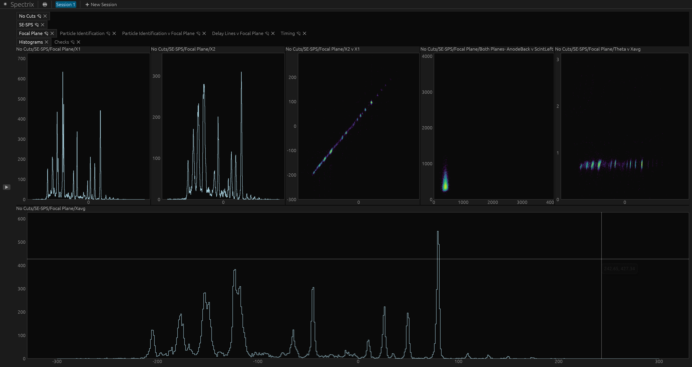

# Spectrix

**Spectrix** is an **AI-assisted spectrum analysis** and experimental event based-data exploration tool. It provides tools for histogramming, Gaussian fitting, interactive visualization of 1D and 2D histograms, and help through **Spectrix AI** (currently in development).

Spectrix is built around event data where users are often working with observables such as energy, time, position, detector channels, calibrated columns, and fitted peak yields. It uses the crates:  
`egui`, `egui-tiles`, `egui_plot`, and `polars`.

Additionally, using **uproot**, you can view 1D and 2D ROOT histograms. Fitting is performed using Python’s **lmfit** library.



---

## Features

- Read and analyze `.parquet` and `.root` files  
- Background ROOT histogram retrieval/export so long uproot operations do not block the UI  
- Combine matching ROOT histograms across multiple files, or load them separately with per-file prefixes  
- Interactive histogramming (1D & 2D)  
- Multi-select 1D/2D histogram source pickers, with safe 2D pair expansion and de-duplication  
- Column-group aliases for detector families, histogram sources, and grouped computed-column creation  
- Searchable picker improvements including natural numeric sorting, glob-style filtering, and bulk select/clear actions  
- Interactive histogram-created cuts for 1D and 2D views  
- Gaussian fitting with Python’s lmfit, including total-fit uncertainty bands  
- Visible-range auto-Y scaling for 1D histograms, with log-Y support  
- UUID peak labels with configurable size/lift and optional guide lines  
- UI-based histogram and cut definition  
- Custom histogram scripting  
- Drag-to-reorder rows in Variables, Column Creation, and Column Groups  
- Spectrix AI assistant for source-grounded usage questions, UI workflow help, and event-data explanations  
- Built-in screenshot capture from the top bar  
- Integration with Polars for high-performance data processing  

---

## Running Spectrix

### Quick Start

If you want the simplest launch path, use:

```bash
./spectrix.sh
```

This script creates/activates `.venv`, installs Python dependencies, sets the required PyO3 environment variables, and runs `cargo run --release`.

---

### Tested Platforms

- **macOS Sonoma 14.6.1** on Apple M3 MacBook Pro (18 GB RAM)  
- **Ubuntu 22.04.5 LTS**  
- **Windows 10**

> ⚠️ Tested with Python 3.13.  
> On Windows, ensure that Python is downloaded from [python.org](https://www.python.org/downloads/).

---

### Install Rust

Ensure you’re using the latest stable version of Rust:

```bash
rustup update
```

If you don’t have Rust installed, visit the [Rust website](https://www.rust-lang.org/tools/install) and follow the instructions.

---

### System Dependencies

**Linux (Ubuntu/Debian):**

```bash
sudo apt-get install libxcb-render0-dev libxcb-shape0-dev libxcb-xfixes0-dev libxkbcommon-dev libssl-dev libgtk-3-dev
```

**macOS:**

Install equivalent libraries using Homebrew as needed for your local toolchain. If build/linking issues appear, run through `./spectrix.sh` first to ensure the Python/PyO3 environment is configured correctly.

---

### Installation Steps

**Clone the repository**

```bash
git clone https://github.com/alconley/spectrix.git
cd spectrix
```

**Create a Python virtual environment and activate it**
```bash
python3 -m venv .venv
source .venv/bin/activate
```

**Install the required python packages**
```bash
pip install -r requirements.txt
```

**(Optional, but often required on macOS; see `./spectrix.sh`) Set the Python environment for Rust (PyO3)**
```bash
export PYO3_PYTHON=$(pwd)/.venv/bin/python
export PYTHONPATH=$(pwd)/.venv/lib/python3.*/site-packages
```

**Run the Rust project in release mode**
```bash
cargo run --release
```

**Tips if the program doesn't run**
```bash
rustup update
cargo clean
cargo update
```

## Overview

The **Spectrix** program reads `.parquet` files using the [Polars](https://docs.rs/polars/latest/polars/) crate.  
Typically, `.parquet` files are generated by [Eventbuilder](https://github.com/alconley/Eventbuilder) for me. These files store raw data as `f64` in a dataframe format (similar to a ROOT tree).  

Histograms can be configured in the left panel of the UI. New column creation and cuts can also be performed directly in the UI.

Additionally, users can read 1D and 2D histograms from ROOT files using the Python package **uproot**. ROOT trees can easily be converted to `.parquet` format using [HEP-Convert](https://hepconvert.readthedocs.io/en/latest/root_to_parquet.html).

---

## Step 1: Getting Files

Use the **Get Files/Directory** button to select either a single file or a directory.

- If you select a directory, Spectrix scans it and loads supported files (`.parquet`, `.root`).
- If you select a single file, only that file is loaded.

### Root Files

If one or more `.root` files are selected, Spectrix attempts to load all 1D and 2D histograms found in those files.

Histogram paths such as `/name1/name2/histogram_name` are preserved and used to organize views into nested container hierarchies.

ROOT retrieval runs in the background, so the UI remains responsive while Spectrix reads histograms through `uproot`. A spinner is shown while retrieval is active, and the operation can be canceled between files.

ROOT loading behavior depends on the **Calculate/Get histograms separately** toggle:

- **Off**: histograms with the same full ROOT path/name are merged together across the selected files.
- **On**: each file gets its own prefix using the file stem, so matching histograms are loaded as separate entries such as `run_001/hEnergy` and `run_002/hEnergy`.

When you start a new ROOT retrieval, Spectrix clears the current histogram contents first so repeated clicks on **Get Histograms** do not double the loaded counts.

After 1D ROOT histograms are loaded, their axes are reset automatically so the plot opens around the imported data instead of staying zoomed near zero.

### Parquet Files

Parquet is the **preferred format** for analysis, since Spectrix can build histograms directly from raw columns using the Histogram Script system.

When one or more `.parquet` files are selected, Spectrix loads the column names automatically when needed so the searchable pickers in the Histogram Script stay populated.

You can also refresh them manually with **Get Column Names** in the **Processor** menu.

In the same section, you can:
- Save filtered versions of your `.parquet` files.
- Combine multiple files into one.

You can also load 2D cuts in this area; those cuts are then available as active cuts and are used when filtering saved `.parquet` outputs.

When saving filtered files, Spectrix applies all enabled **active 1D/2D cuts** from the Histogram Script cut sections and writes output using `filename_{suffix}.parquet` naming.

Interactive cuts created directly on 1D histograms, and on 2D histograms that resolve to a single X/Y source pair, also appear in the same active-cuts area, so they can be enabled/disabled for histogram generation and parquet filtering before being added manually to the script.

When combining parquet files, Spectrix scans the selected inputs lazily and streams the merged result directly to the output parquet sink. It does **not** collect the full combined dataset into memory first.

Large combines can still take time and produce large output files, so reducing files with cuts first can still be a useful workflow when you only need a subset of the data.

---

## Histogram Script

The **Histogram Script** panel can be opened or closed using the **“Histograms”** button under the **“Get Files”** button.

This tool allows you to:
- Define reusable numeric **variables**.
- Define reusable **column groups** that alias one name to many detector/source columns.
- Define new analysis columns from existing parquet columns.
- Define calibration/gain-match/shift transforms with a dedicated **Calibration** table.
- Define and manage **1D and 2D cuts**.
- Define **1D and 2D histograms** (name, one or more source columns/source pairs, bins, range, and applied cuts).
- Save/load complete histogram-script setups as `.json` configuration files.

### Typical Workflow

1. Load one or more parquet files and make sure the column names are available.
2. Add reusable variables if you want named constants such as calibration coefficients.
3. Add column groups if you want one alias to stand for a detector family such as `S1RingTime`.
4. Create any derived columns you need with the computed-column builder and/or the Calibration table.
5. Define cuts with the 1D cut builder and/or 2D graphical cuts.
6. Create histogram definitions and attach active cuts.
7. Save the configuration to JSON so the same analysis can be reused.

---

### Example

Below are example images of Spectrix using the sample file located at  
`./example/run_83_reduced.parquet`.

This dataset comes from a one-hour measurement of the **52Cr(d,pγ)53Cr** reaction.  
The file is pre-filtered to include only proton data (the full dataset was too large for GitHub).  

Invalid detector values are stored as `-1e6`, which marks cases where a detector did not register a hit within an event window.  
This ensures that all columns have the same length.  
The file was generated using [Eventbuilder](https://github.com/alconley/Eventbuilder).

---

The following subsections assume you are in the **“General”** section of the **Histogram Script** panel.

### Column Creation

You can create derived columns such as time differences, sums, averages, calibrated values, or polynomial-style transforms.

Derived columns can then be used exactly like native columns in cuts and histogram definitions.

The computed-column UI now uses a dedicated **Builder** panel:

- The table row shows the column alias, a **Builder** button, the term count, and a one-line expression summary.
- The builder opens below the table and edits one computed column at a time.
- The builder includes an **Output Name** field. Aliases are sanitized automatically so they only contain letters, numbers, underscores, and optionally `{}` for grouped output naming.
- Column and variable selection uses searchable combo boxes with natural numeric ordering, so detector names such as `Ring0`, `Ring1`, `Ring10` sort in the expected order.
- Search boxes support normal substring matching and glob-style filters such as `S1Ring*Time` or `S1Ring?Time`.
- Multi-select pickers keep the selected entries listed at the top and provide **Select All** / **Clear All** actions, which is useful after a good glob filter.
- Rows in **Column Creation** can be reordered with the `↕` drag handle.
- Each term can be:
  - `Column` or `Constant`
  - added or subtracted from the expression
  - multiplied by a coefficient that is a `Value`, `Variable`, or another `Column`
  - raised to a power, including fractional powers such as `0.5`

Column groups also work inside **Column Creation**:

- Group aliases defined in **Column Groups** appear anywhere the builder accepts a source column.
- If one group alias is used in an expression, Spectrix creates one computed column per resolved group member.
- If multiple group aliases are used in the same expression, Spectrix expands **all combinations**.
- The builder tells you how many grouped columns will be created and previews the generated output names.
- If the **Output Name** contains `{}`, Spectrix replaces it with the grouped source column names.
- If `{}` is omitted, Spectrix appends the grouped source column names automatically.

### Variables

The **Variables** section lets you define reusable named constants such as `a`, `m`, and `c`.

- Variable names follow the same identifier rules as column aliases: letters, numbers, and underscores only.
- Variable names cannot safely overlap with real or computed column names.
- Variables can be reused in any computed-column term where the coefficient type is set to **Variable**.
- Variable rows can be reordered with the `↕` drag handle.

Example:

- `a = 2.5`
- `m = -1.2`
- `c = 15.0`

You can then reuse those values in multiple computed columns without retyping them each time.

### Column Groups

The **Column Groups** section lets you define one alias that stands for many real columns.

This is especially useful for detector arrays or ring/segment families such as:

- `S1RingTime -> S1Ring0Time, S1Ring1Time, S1Ring2Time, ...`
- `S1RingEnergy -> S1Ring0Energy, S1Ring1Energy, S1Ring2Energy, ...`

Column-group aliases can then be reused in both histogram definitions and computed-column expressions.

- Group aliases follow the normal identifier rules: letters, numbers, and underscores.
- Group members are chosen with the same searchable multi-select picker used elsewhere in Histogram Script.
- Group rows can be reordered with the `↕` drag handle.
- Group aliases appear in histogram source pickers and in the **Column Creation** builder anywhere a source column can be selected.

For histograms:

- If a 1D histogram source resolves to a group alias and the histogram name does **not** contain `{}`, Spectrix fills that same histogram once per resolved member column.
- If the 1D histogram name **does** contain `{}`, Spectrix creates one histogram per resolved member and inserts the detected group token into the name.
- Group aliases can also be used on the X and/or Y side of 2D histograms.

### Computed Column Examples

**Average of two focal-plane channels**

1. Add a new column and set the alias to `Xavg_manual`.
2. Open **Builder**.
3. Add two terms:
   - first term: `Column`, coefficient `Value = 0.5`, source column `X1`, power `1`
   - second term: `+ Column`, coefficient `Value = 0.5`, source column `X2`, power `1`

This produces:

```text
(0.5 * X1) + (0.5 * X2)
```

**Square-root calibration using variables**

1. Define variables `a = 3.0` and `c = -12.0`.
2. Add a new column and set the alias to `Xsqrt_cal`.
3. Open **Builder**.
4. Add two terms:
   - first term: `Column`, coefficient `Variable = a`, source column `Xavg`, power `0.5`
   - second term: `+ Constant`, coefficient `Variable = c`

This produces:

```text
(a * Xavg ** 0.5) + (c)
```

**Grouped time-difference columns**

1. In **Column Groups**, define `S1RingTime` using members such as `S1Ring0Time`, `S1Ring1Time`, and `S1Ring2Time`.
2. In **Column Creation**, add a new row and set the expression to `RF - S1RingTime`.
3. Set **Output Name** to either:
   - `RFMinusS1RingTime` if you want Spectrix to append the grouped source names automatically, or
   - `RFMinus{}` if you want the grouped source names inserted at the `{}` location.

This creates outputs such as:

```text
RFMinusS1RingTime_S1Ring0Time
RFMinusS1RingTime_S1Ring1Time
RFMinusS1RingTime_S1Ring2Time
```

### Calibration

The **Calibration** section under the **General** Histogram Script tab is a faster way to apply
per-column quadratic transforms of the form:

```text
output = A*input^2 + B*input + C
```

This is useful for energy calibration, gain matching, or simple shifts without building each
column manually in **Column Creation**.

- Use the **Add column** picker and `+` button to choose which source columns should have calibration rows.
- Each row contains:
  - **Column Name**
  - **A**
  - **B**
  - **C**
  - **Output Column Name**
- The default coefficients are `A = 0`, `B = 1`, `C = 0`.
- The default output column name matches the source column name.
- If the output column name stays the same as the source column name, the calibrated result overwrites that column name in Histogram Script outputs.
- If the output column name is changed, Spectrix creates a separate calibrated output column instead.
- Rows only create additional/overwritten calibrated columns when the coefficients are not the default `0, 1, 0`.

The calibration table is designed to work well across changing parquet schemas:

- If a row's source column is not present in the currently loaded parquet file, that row is shown in **red**.
- Red rows are preserved in the table, but they are skipped during calculation until a matching parquet column exists again.
- Switching parquet files does not delete existing calibration rows.

CSV import/export is also supported:

- **Import [.csv]** reads calibration rows from a CSV file.
- **Export [.csv]** writes the current calibration table to CSV.
- The expected columns are:

```text
column_name,a,b,c,output_column_name
```

- If the CSV header or some rows are imperfect, Spectrix warns the user but still fills every calibration value it can recognize.
- Imported rows whose source columns are not in the current parquet schema are still kept and shown in red.
- The currently loaded calibration CSV path is displayed at the top of the section.
- Clicking the `X` next to that path clears the loaded CSV association and resets the imported values from that file.
- **Clear All** removes every calibration row and clears the loaded calibration CSV association.

Calibrated output columns from this section behave like other derived columns:

- They can be selected in histogram definitions and cuts.
- They are added to the available column list in the Histogram Script UI.
- When filtered parquet files are saved, active calibration rows are applied there too.

### Cuts

You can define:

- **1D cuts** with the builder UI, or by loading saved 1D cut JSON files with **`+1D Load`**.
- **2D cuts** as graphical polygons in the 2D histogram view.

Interactive 2D cuts are only available on 2D histograms that have one unambiguous X/Y source pair. If a 2D histogram is filled from multiple source pairs, Spectrix disables plot-created 2D cuts for that plot.

For cut management in the Histogram Script UI, you can:

- Add a blank 1D cut with **`+1D Manual`**.
- Load a saved 1D cut with **`+1D Load`**.
- Load a cut JSON individually for 2D cuts with **`+2D`**.
- Add a cut folder to load multiple cut files.
- Use **Active Histogram Cuts** created interactively in 1D or 2D plots, even before saving them to disk.

The **1D cut** UI is builder-first:

- Click **Builder** in the cut row to open the dedicated editor below the table.
- Each **Expression** is one parenthesized group.
- Conditions inside the same expression are combined with **AND**.
- Separate expressions are combined with **OR**.
- Each condition uses:
  - a searchable column picker
  - an operator picker
  - a numeric value field
- Use **Add Condition** to add another AND clause to the current expression.
- Use **Add OR Expression** to start a new OR group.

Supported comparison operators in the builder are:

- `>`
- `>=`
- `<`
- `<=`
- `==`
- `!=`

Spectrix automatically generates the underlying logical expression string from the builder, so the user does not need to type it manually.

### 1D Cut Examples

**Single range gate**

1. Add a 1D cut with **`+1D Manual`**.
2. Name it `Column1Window`.
3. Open **Builder**.
4. In `Expression 1`, add:
   - condition 1: column `Column1`, operator `>=`, value `-100`
   - condition 2: column `Column1`, operator `<=`, value `100`

This produces:

```text
((Column1 >= -100) & (Column1 <= 100))
```

**Two alternative gates joined with OR**

1. Add a 1D cut and name it `GoodColumns`.
2. Open **Builder**.
3. In `Expression 1`, add:
   - condition 1: column `Column1`, operator `>=`, value `0`
   - condition 2: column `Column1`, operator `<=`, value `4096`
4. Click **Add OR Expression**.
5. In `Expression 2`, add:
   - condition 1: column `Column2`, operator `>=`, value `0`
   - condition 2: column `Column2`, operator `<=`, value `4096`

This produces:

```text
((Column1 >= 0) & (Column1 <= 4096)) | ((Column2 >= 0) & (Column2 <= 4096))
```

Cuts that were loaded from disk or explicitly saved to disk remember their save path. If you later edit the cut name or cut values inside Spectrix, the cut is automatically re-saved back to that same file.

Only cuts enabled in the corresponding UI checkboxes are applied during histogram generation and parquet filtering.

### Histogram Definitions

Enter the histogram name and select the input column(s), bin count, and axis range.

Using slashes (`/`) in histogram names automatically groups plots into nested containers.

The histogram source-column fields use searchable pickers, so source columns can be chosen directly from the loaded parquet columns, computed aliases, or **Column Groups** aliases. Then specify range, binning, and which active cuts should be applied.

Picker behavior in histogram rows matches the rest of Histogram Script:

- Natural numeric sorting keeps detector names such as `Ring0`, `Ring1`, `Ring10` in the expected order.
- Search boxes support substring filtering and glob-style patterns such as `S1Ring*Time`.
- Multi-select pickers show selected entries at the top and provide **Select All** / **Clear All** actions.

- **1D histograms** support selecting multiple source columns in a single histogram row. Spectrix fills the same 1D histogram once per selected source column.
- A 1D source can also be a **Column Group** alias, so one histogram row can stand in for many detector columns.
- If a 1D histogram name contains `{}`, Spectrix creates one histogram per resolved grouped source and inserts the detected token into the name.
- If a 1D histogram is filled from more than one source column or configuration, its displayed source-column metadata is cleared instead of pointing at only one of the inputs.
- **2D histograms** support selecting multiple X columns and multiple Y columns in a single histogram row.
- Spectrix expands those selections into explicit `(x, y)` source pairs before filling.
- X and Y selections can also include **Column Group** aliases.
- Self-pairs where `x` and `y` resolve to the same column are skipped.
- Mirrored pairs such as `(A, B)` and `(B, A)` are only filled once, so the same detector pairing is not double-counted.
- If a 2D histogram name contains `{}`, Spectrix uses the detected X token, Y token, or `X_Y` combination when expanding grouped names.
- If a 2D histogram is filled from more than one X/Y source pair, its stored axis-source metadata is cleared and plot-created 2D cuts are disabled for that histogram.

If a cut is defined but not enabled, it will not affect that histogram.

### Save and Reload Configurations

Histogram Script definitions can be saved to JSON and loaded later.

This is useful for:
- Reproducing the same analysis between runs.
- Sharing analysis setups with collaborators.
- Building experiment-specific templates that can also be used by Custom Scripts.

---

## UI Convenience

- A screenshot button lives in the top bar next to the light/dark theme toggle. Clicking it prompts for a save location and writes the current Spectrix window as a `.png`.
- In the session context menu, **Reset Histogrammer** is placed directly beside the **Histogrammer** menu button for quicker access during iterative analysis.

---

## Custom Scripts

The **Custom Scripts** section provides a UI-based way to define and load pre-configured histogram setups.  
These scripts act as a front-end to the **Histogram Script**, allowing users to quickly initialize commonly used columns, cuts, and histograms without manually creating them each time.

In other words, the Custom Scripts system automatically generates a full histogram configuration through the interface — simplifying setup for frequent or experiment-specific analyses.

Currently, the included custom scripts are tailored for work relevant to **Florida State University (FSU)** experiments and setups.  
These include example configurations for detector systems such as SE-SPS, [ICESPICE](https://doi.org/10.1016/j.nima.2026.171389), and [CeBrA](https://doi.org/10.1016/j.nima.2023.168827).

Each custom script automatically populates the **Histogram Script** panel with:
- Commonly used **columns** (e.g., timing differences)  
- Predefined **cuts** for data selection  
- Standard **1D and 2D histograms** for quick visualization and analysis  

The Custom Scripts system was designed to be easily adaptable for adding new configurations. If you want help creating one, open an issue and include your experiment-specific requirements.  

For those at FSU, the **SE-SPS** custom configuration is currently the most complete and ready for use.  
The other scripts are still under development as part of the ongoing experimental setup.

## 1D Histograms

The 1D histogram interface in **Spectrix** is designed for fast, interactive peak fitting and inspection, with a workflow centered on markers, region selection, and stored fit results.

### What You Can Do

- Interactively place and move peak, background, and region markers.
- Fit one or many Gaussian peaks in a selected region.
- Choose and tune background models: linear, quadratic, power law, exponential.
- Detect peaks with `find_peaks`, with optional region-limited searching and background subtraction.
- Optionally draw an uncertainty band around the total Gaussian fit from the Fit Panel.
- Auto-fit the Y axis to the tallest bin in the current visible X range.
- Rebin and restyle plots from the context menu.
- Create interactive 1D cut regions directly on the histogram and reuse them as active cuts.
- Store fit results and review them in a dedicated popup window or from the right-click Fits menu.
- Open the Fit Panel either inside Spectrix or as a separate native window with **Pop Out** when the backend supports extra viewports.
- Click **Modify** on a stored fit to move it back into the temp fit editor with its saved markers/settings.
- Click **Refit** in the Fit Panel header to re-run all stored fits on the latest incoming data.
- View histogram statistics in both raw-channel and calibrated display modes.
- Adjust UUID label size/lift and optionally draw a guide back to the composition curve.
- Use keyboard-driven controls for quick analysis loops.

### Fitting Engine

Spectrix uses Python [lmfit](https://lmfit.github.io/lmfit-py/builtin_models.html) for nonlinear fitting, called from Rust via [PyO3](https://docs.rs/pyo3/latest/pyo3/).

Fitting was originally implemented with [varpro](https://github.com/geo-ant/varpro), but `lmfit` now powers the current pipeline because it provides flexible model composition, robust parameter constraints, and detailed fit reporting with less custom maintenance.


### Energy Calibration, UUIDs, and Exported lmfit Results

Each fitted Gaussian peak carries two pieces of analysis metadata:

- **UUID**: an integer identifier used to track the same physical state across fits and downstream analysis steps. If the UUID is not `0`, its number is drawn above the fitted composition peak. UUID text follows the light/dark theme, stays out of the legend, and can be resized/lifted with an optional dashed guide line from the Fit Panel.
- **Assigned energy**: reference energy (and uncertainty) used to build a channel-to-energy calibration.

If a peak has no assigned energy, Spectrix stores **`-1`** as the invalid sentinel value (with zero uncertainty). Peaks with energy `-1` are ignored when calibration points are collected.

Calibration is built from stored fits using peak centroids (`mean`) versus assigned energies:

- **Linear** calibration requires at least 2 valid points.
- **Quadratic** calibration requires at least 3 valid points.

After solving for calibration coefficients, Spectrix propagates uncertainties and attaches calibrated quantities to fit parameters.

This metadata is also written into the underlying lmfit `ModelResult` payload:

- peak UUID (`g{i}_uuid`)
- assigned energy and uncertainty (`g{i}_energy`, `g{i}_energy_uncertainty`)
- calibrated Gaussian parameters, including `g{i}_center_calibrated`, `g{i}_sigma_calibrated`, `g{i}_fwhm_calibrated`, plus calibrated copies for area/amplitude/height
- calibration constants and uncertainties, including `calibration_a`, `calibration_b`, `calibration_c`, and `calibration_a_uncertainty`, `calibration_b_uncertainty`, `calibration_c_uncertainty`
 - fit marker metadata for Python interoperability:
  - `region_marker_count`, `region_marker_0`, `region_marker_1`, ...
  - `peak_marker_count`, `peak_marker_0`, `peak_marker_1`, ...
  - `bg_marker_count`, `bg_marker_start_0`, `bg_marker_end_0`, ...
  - fit/background flags: `bg_model_type`, `fit_equal_sigma`, `fit_free_position`

Stored-fit modify/refit behavior:

- **Modify** removes the selected fit from the stored list, restores its marker/background settings, and moves it into the temp-fit slot for editing.
- On refit, Spectrix preserves existing UUID and assigned-energy values by remapping prior assignments onto the new fitted peak means.
- If background model is `None`, no background markers are restored/generated.


Because of that, exported lmfit `.sav` files include both fit parameters and calibration/UUID context, so they can be loaded and further analyzed directly in Python (for example with `lmfit.model.load_modelresult`).

When an exported lmfit `.sav` file is loaded back into Spectrix, the total-fit `1σ` uncertainty band is rebuilt immediately. Spectrix first tries lmfit `eval_uncertainty`; if the saved result cannot provide that directly, Spectrix falls back to an approximate band reconstructed from the stored parameter errors.

### Which Save Format To Use

- **Save Fits / Load Fits (`.json`)**: best for restoring and continuing your work inside Spectrix.
- **Export All lmfit Results / Load lmfit `.sav`**: best when you want to continue analysis in Python with `lmfit`.
- If you are not planning to continue in Python/lmfit, prefer **Save Fits / Load Fits**.

### Keybind Reference

Cursor must be inside the plot for keybinds to be active.

| Key | Action | Notes |
|---|---|---|
| **P** | Add peak marker | Places a Gaussian peak marker at cursor position. |
| **B** | Add background marker | Used for background-only sampling points. |
| **C** | Create 1D cut | Creates a draggable 1D cut region using the histogram’s current source column. |
| **R** | Add region markers | Define fit interval; drag marker center with middle mouse button. |
| **-** | Remove nearest marker | Deletes marker closest to cursor. |
| **Delete** | Clear temporary markers/fits | Removes active markers and temporary fit curves. |
| **G** | Fit background | Uses selected background model and current background markers. |
| **F** | Fit Gaussians | Fits peaks in region; auto-fits background first if needed. |
| **O** | Detect peaks | Runs the peak finder and places peak markers at the detected locations. |
| **S** | Store fit | Saves current fit result for later comparison/export. |
| **I** | Toggle statistics | Shows/hides stats such as mean, counts, and sigma for the current visible range. |
| **L** | Toggle log Y-axis | Switches between linear and logarithmic Y scaling while keeping the current X range. |
| **Y** | Toggle auto-fit Y | Fits Y to the tallest visible bin with about 15% headroom. |

### Fit Behavior Notes

- The default background model is **Linear**.
- 1D auto-fit Y is enabled by default and uses the maximum bin height in the current visible X range with `1.15x` headroom in both linear and log modes.
- If no background markers are present, Spectrix will still fit Gaussians on top of a fitted background model.
- Background markers and an explicit background fit help the solver converge faster and let you control which region is used to determine the background.
- Multiple Gaussian peaks can be fit simultaneously when multiple peak markers exist in the active region.
- Peak finding settings are available from the right-click **Peak Finder** submenu, including min/max height, prominence, difference, plateau size, and distance controls with hover help.
- If exactly two region markers are active, peak finding only searches the data between them.
- If a background fit is active, Spectrix subtracts that background before peak finding.
- Detected peaks are written back into the plot as peak markers so they can be fitted immediately.
- The **1σ Uncertainty** checkbox under **Show Fit Lines** toggles the total Gaussian uncertainty band.
- That total-fit uncertainty band uses lmfit `eval_uncertainty` at `1σ`.
- By default, peaks share a common standard deviation; this can be changed in fit settings.
- Peak positions and widths can be constrained or locked from the *Fits* menu.
- UUID labels are drawn above the composition curve using the larger of the composition height or the tallest nearby bin, so they stay readable on real peaks.
- The **UUID Labels** controls in the Fit Panel let you change label **Size**, **Lift**, and an optional dashed **Guide** line back to the composition curve.
- The Fit Panel can be popped out into its own window with the **Pop Out** toggle next to **Show Fit Panel**; if native child windows are unavailable, egui falls back to an embedded window.
- Pop-out Fit Panel contents follow the active light/dark theme, including the UUID label colors drawn on fit plots.
- Fit reports, curves, and parameter values are available from the plot context menu.

> Additional controls such as peak finding, rebinning, marker styling, and display options are available by right-clicking on the 1D plot.

### 1D Cut Notes

- Press **C** (or use the right-click **Cuts** menu) to create a new interactive 1D cut.
- The cut starts as two vertical lines spanning slightly inside the current visible X range.
- You can drag either boundary line directly.
- You can also click and drag between the two lines to move the entire cut window while keeping the same width.
- A default cut name is generated automatically in the form `Histogram Name 1D Cut N`.
- The cut expression is generated as `(ColumnName >= (x1)) & (ColumnName <= x2)`.
- 1D cuts created interactively in the plot appear in the **Active Histogram Cuts** area of the Histogram Script.
- The cut **Info** menu shows the parsed column name, lower bound, upper bound, full expression, and saved path.
- If a 1D cut was loaded from disk or previously saved to disk, changing the cut name or moving the cut region will automatically re-save it to the same path.
- 1D cuts created on 2D projection windows inherit the projection axis column name automatically.

---

## 2D Histograms

The 2D histogram interface in **Spectrix** is optimized for fast visual exploration, gated selection, and axis projection workflows.

### What You Can Do

- Navigate and inspect dense 2D distributions interactively.
- Create X and Y projections directly from selected regions.
- Draw and edit polygon gates for event selection.
- Switch colormaps, reverse palettes, and toggle log/linear normalization.
- Rebin data and tune Z-scale display ranges.
- Save and reuse graphical cuts from the plot context menu.
- Reuse histogram-created cuts through the shared active-cuts area in the Histogram Script.

### Keybind Reference

Cursor must be inside the plot for keybinds to be active.

| Key | Action | Notes |
|---|---|---|
| **X** | Create X projection | Creates an X projection region initialized slightly smaller than the current axis span. |
| **Y** | Create Y projection | Creates a Y projection region initialized slightly smaller than the current axis span. |
| **I** | Toggle statistics | Shows/hides summary stats such as mean, counts, and sigma. |
| **M** | Change colormap | Cycles through available colormap presets. |
| **Z** | Toggle normalization | Switches between logarithmic and linear color scaling (default is log). |
| **R** | Reverse colormap | Flips the active colormap direction. |
| **C** | Create graphical cut | Click to add vertices, drag to edit, double-click to finish polygon. |

### Projection Notes

- Pressing **X** or **Y** creates a projection region that starts slightly smaller than the visible axis limits.
- Projection boundary lines can be adjusted by clicking and dragging the center dot on a boundary line.
- Clicking and dragging between the two projection lines translates the whole projection window while keeping the same width.
- You can also right-click the 2D plot and open **Projections** in the context menu to adjust projection values directly.

### Cut Notes

- Press **C** (or add a cut from the right-click menu) to start a new interactive polygon cut.
- The 2D histogram must have one unambiguous X/Y source pair for 2D cuts to be available.
- If the histogram was filled from multiple X/Y source pairs, Spectrix clears the stored X/Y source labels and disables plot-created 2D cuts for that histogram.
- **Click** to add each vertex.
- **Double-click** to finish the polygon.
- After creation, **click and drag a vertex** to reposition it.
- The cut auto-populates the X/Y column names from the current 2D histogram axes; verify these before saving.
- A default cut name is generated automatically in the form `Y v X Cut N` (for example `E2 v E1 Cut 1`), and you can rename it before saving.
- Use **Save** to write the cut to JSON for reuse.
- Even if a cut is not saved to disk yet, it can still appear in the Histogram Script as an **Active Histogram Cut** and be toggled on/off for histogram generation.
- The cut **Info** menu shows the X/Y columns and saved path.
- Saved cuts can be reloaded, recolored, and reopened for vertex editing.
- If a 2D cut was loaded from disk or previously saved to disk, changing the cut name or moving vertices will automatically re-save it to the same path.

> Right-click on the 2D plot for additional controls, including rebinning, colormap/color-scale tuning, projection options, and cut management.

---

## Analysis

The **Analysis** feature in Spectrix is still in a **preliminary stage**, but it establishes the groundwork for more advanced data interpretation and reaction analysis tools planned for future versions.

At this stage, the focus is on **cross-section analysis** for **SE-SPS** experiments.

### SE-SPS Cross-Section Analysis

This analysis module utilizes the **fit results** generated in the **Histogrammer** to extract information about the yield of each excited state.  
By combining the fitting data with experimental parameters — such as **reaction information**, **beam current integrator data**, and other relevant metadata — Spectrix can calculate and plot the **cross section** for each excited state.

Each state is tracked and referenced using a **UUID (Universally Unique Identifier)**, which ensures that every fitted peak and corresponding physical quantity can be uniquely identified and associated across multiple analysis steps.  
This makes it straightforward to compare results between datasets or refine fits without losing the connection to the original event or energy level.

While the SE-SPS analysis is currently the only implemented module, the system is designed to be **modular and easily expandable**.

> ⚠️ **Note:**  
> The SE-SPS cross-section analysis is still experimental and under active development

---

## License

Spectrix is source-available collaboration software owned by Alex Conley. You may use it and modify it for personal, academic, research, or internal purposes, and contributions should be submitted back to the official project by pull request or patch.

Redistribution, public forks or mirrors, sublicensing, resale, hosted copies, and publishing modified versions elsewhere are not permitted without prior written permission.

See [LICENSE](./LICENSE) for the full terms.
